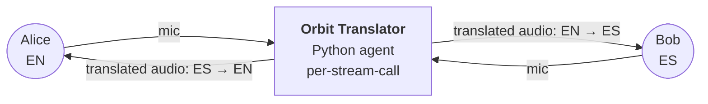
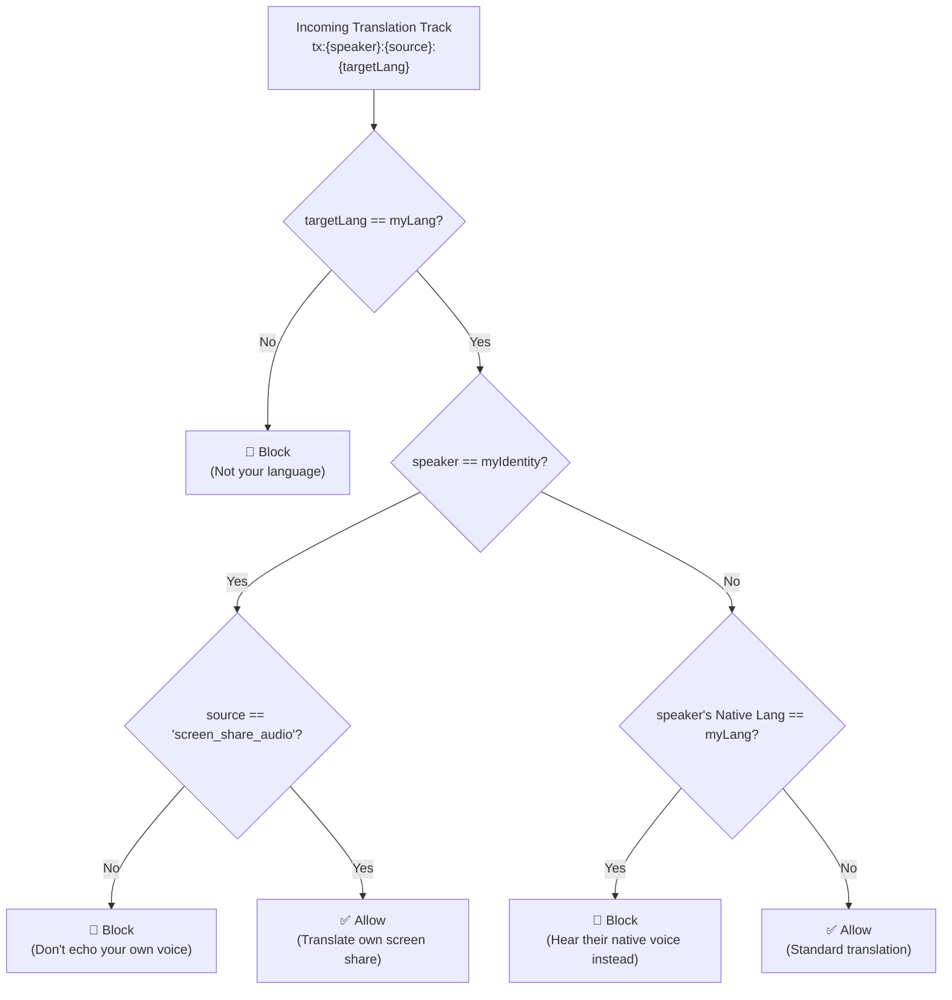

# 🛸 Orbit Meeting — by Eburon AI

**Real-time AI voice translation for video meetings.**  
Speak your language. Hear theirs. Translation spins up on demand — same-language pairs cost nothing.

Proudly built by [Eburon AI](https://eburon.ai) — founded by Joe Lernout.

🌐 **Live at [orbit.eburon.ai](https://orbit.eburon.ai/)**

    

---

## What it does

Anyone with the link joins as a peer. Each participant picks one language — that's what they speak **and** what they want to hear everyone else in. When someone speaks, a Gemini Live session translates their audio into every other distinct language present in the room, on demand.

- **Up to 40 participants** per room (configurable)
- **240+ languages** — pick yours from the world's most comprehensive language list
- **Mic + camera** default off; toggle when you're ready
- **Captions sidebar** with auto-scroll transcripts in each listener's language
- **Screen share with audio translation** — shared content is always translated regardless of the sharer's declared language
- **Start/stop translation** — toggle per meeting from the sidebar
- **Mute original audio** — hear only the translation when you want
- **Gallery View** — responsive grid layout, full-screen when alone, clean tiles as participants join
- **Host moderation** — mute, request camera, remove participants, manage breakout rooms
- **Breakout rooms** — isolated Stream calls with host assignment and one-click return
- **Local recording** — capture meeting audio/video to your device (File System Access API + download fallback)
- **Supabase auth** — email sign-up/login, password reset, anonymous fallback
- **Zoom-style Settings** — camera preview, virtual backgrounds, recording preferences persisted via Supabase
- **Electron desktop app** — native macOS/Windows/Linux with Ollama auto-install on first launch
- **PWA** — installable on mobile and desktop browsers with offline fallback
- **Android APK** — hybrid Capacitor app loading the production web app

## How it works

**Orbit Meeting** runs on **[GetStream.io Video SDK](https://getstream.io/video/)** — low-latency WebRTC with a global SFU edge network. A Python translator agent joins each call as a programmatic participant, listens to every speaker, and publishes translated audio + captions in every listener's language via Gemini Live.



Each participant's chosen language is stored in their Stream user `custom` object (the `lang` field). The agent reconciles a map of `(speaker, target_lang)` sessions — one Gemini Live session per unique pair, **skipping pairs where source == target** (same-language pairs hear each other natively, zero Gemini cost).

**Screen share audio** is translated regardless of the sharer's declared language.

For each active pair the agent publishes into the Stream call:

- an audio track with custom metadata identifying it as a translation for `{sourceIdentity}:{targetLang}`
- translation captions as custom events with `type: "translation"`, tagged with `target_lang`

The frontend subscribes to the appropriate tracks based on `(listener_lang, speaker_lang)`, applying volume levels according to mute preferences.

### Translation Routing Logic

The frontend dynamically filters which translation tracks it subscribes to based on the following logic matrix (implemented in `useTranslationRouting.ts`):



### End-to-End Translation Workflow

1. **Room Setup**: Frontend calls `GET /api/token` which mints a Stream JWT and upserts the user via the Stream REST API.
2. **Agent Join**: The Python translator agent joins the Stream call as a programmatic WebRTC participant with `custom.is_agent = true`.
3. **Demand Reconciliation**: Agent watches participant joins/leaves and language attribute changes (via `call.updateCallMembers` listeners), computes `(speaker, target_lang)` pairs.
4. **Audio Capture**: Agent reads PCM audio from each speaker's published audio track, downsampling to 16 kHz mono for Gemini.
5. **Gemini Translation**: Raw WebSocket to Gemini Live `BidiGenerateContent` — sends audio, receives translated audio (24 kHz) + transcriptions.
6. **Output Publication**: Agent publishes translated audio tracks and sends captions as custom events (`type: "translation"`).
7. **Frontend Routing**: `useTranslationRouting.ts` filters agent-published tracks by target language, speaker language, and mute preferences. Human mic tracks are ducked to 15% when "mute original" is on.
8. **Teardown**: Agent tears down Gemini sessions on a 10s grace timer when demand disappears (speaker mutes, last listener leaves). Immediate teardown on disconnect.

---

## Installation and Setup

### Prerequisites

- Node.js 20+, [pnpm](https://pnpm.io/)
- Python 3.10+, [uv](https://docs.astral.sh/uv/)
- A [GetStream.io](https://getstream.io/video/) account (free tier works)
- A [Gemini API key](https://aistudio.google.com/apikey)

### Run locally

```bash
# 1. Install deps and seed env files
pnpm run setup

# 2. Fill credentials in .env.local and translator/.env.local
#    STREAM_API_KEY, STREAM_SECRET_KEY (both files)
#    GEMINI_API_KEY (translator/.env.local only)

# 3. Run frontend
pnpm run dev:web
```

Open <http://localhost:3000>, click **Create session**, share the URL with another browser, pick different languages, unmute.

---

## Downloads & Distribution

| Platform      | Format                    | Build command               |
|---------------|---------------------------|-----------------------------|
| **Web** (PWA) | Installable via browser   | Auto-deployed to Vercel     |
| **macOS**     | `.dmg` / `.zip`           | `pnpm electron:build:mac`   |
| **Windows**   | `.exe` (NSIS) / portable  | `pnpm electron:build:win`   |
| **Linux**     | `.AppImage` / `.deb`      | `pnpm electron:build:linux` |
| **Android**   | `.apk` (debug)            | `pnpm mobile:build`         |
| **Android**   | `.apk` / `.aab` (release) | `pnpm mobile:build:release` |

### Build the Android APK

Requires Android SDK. On any machine with it installed:

```bash
pnpm mobile:sync     # Sync web assets
cd android && ./gradlew assembleDebug
# APK → android/app/build/outputs/apk/debug/app-debug.apk
```

---

## Repo layout

```text
root (pnpm, Next.js 16)
├── src/                              # Next.js 16 (Turbopack, React 19)
│   ├── app/
│   │   ├── page.tsx                  # Landing — create/join/schedule
│   │   ├── globals.css               # All styles (CSS custom properties theming)
│   │   ├── layout.tsx                # Root layout with AuthProvider + UserProvider
│   │   ├── ServiceWorkerRegister.tsx # PWA service worker registration
│   │   ├── api/
│   │   │   ├── token/route.ts        # Mints Stream JWT + upserts user metadata
│   │   │   ├── translate-voice/      # One-shot Gemini voice translation
│   │   │   ├── translate-text/       # One-shot Gemini text translation
│   │   │   ├── breakout/             # Breakout room management
│   │   │   ├── moderate/             # Moderation actions
│   │   │   └── record/               # Recording control
│   │   ├── session/[id]/
│   │   │   ├── page.tsx              # Pre-flight: name + language picker
│   │   │   └── room/                 # In-call UI (all meeting components)
│   │   ├── auth/                     # Supabase email auth pages
│   │   │   ├── login/                # Sign in form
│   │   │   ├── signup/               # Sign up form
│   │   │   ├── callback/             # Auth code exchange + recovery redirect
│   │   │   ├── reset-password/       # Forgot password
│   │   │   └── update-password/      # Set new password
│   │   └── settings/                 # Zoom-style settings page
│   ├── lib/
│   │   ├── config.ts                # Frontend caps (MAX_PARTICIPANTS, etc.)
│   │   ├── languages.ts             # 240+ languages
│   │   ├── supabase.ts              # Client-side Supabase client
│   │   └── supabase-server.ts       # Server-side Supabase client (cookies)
│   └── context/
│       ├── AuthContext.tsx           # Supabase auth wrapper
│       └── UserContext.tsx           # Supabase-backed user profile
├── translator/                       # Python translator agent (uv + vision-agents)
│   ├── src/
│   │   ├── agent.py                 # Agent entrypoint via vision-agents
│   │   ├── router.py                # TranslationRouter: reconcile loop
│   │   ├── session.py               # GeminiSession: raw WebSocket → Gemini Live API
│   │   ├── audio.py                 # PCM frame plumbing
│   │   └── config.py                # Agent caps (mirror src/lib/config.ts)
│   ├── tests/
│   │   └── test_router.py           # 14 pure demand-computation tests
│   └── Dockerfile                   # For Cloud deploy
├── electron/                         # Electron desktop wrapper
│   ├── main.js                      # Next.js server lifecycle + BrowserWindow
│   └── preload.js                   # Context bridge for native dialogs
├── android/                          # Capacitor Android project
│   ├── app/                         # Android app with WebView
│   └── gradle/                      # Gradle wrapper
├── public/
│   ├── manifest.json                # PWA manifest
│   ├── sw.js                        # Service worker (network-first with cache fallback)
│   ├── icon.svg                     # Source icon (Orbit globe + speech bubbles)
│   └── icons/                       # Generated PNG icons (192px, 512px, etc.)
├── .github/workflows/
│   └── deploy.yml                   # Vercel auto-deploy on push to main
├── capacitor.config.ts              # Capacitor config (loads from production URL)
└── out/                             # Capacitor web fallback directory
```

## Commands

```bash
pnpm run setup              # Idempotent — seeds .env + installs both halves
pnpm run dev                # Frontend + agent concurrently (web always starts)
pnpm run dev:web            # Frontend only (next dev on :3000)
pnpm run dev:agent          # Agent only (uv run python src/agent.py dev)
pnpm run dev:electron       # Frontend + Electron desktop app
pnpm build                  # Production build (output: standalone)
pnpm start                  # Next.js production server
pnpm lint                   # ESLint

# Desktop (Electron)
pnpm electron:build:mac     # Build macOS .dmg
pnpm electron:build:win     # Build Windows .exe
pnpm electron:build:linux   # Build Linux .AppImage + .deb

# Mobile (Android APK via Capacitor)
pnpm mobile:sync            # Sync web assets to Android
pnpm mobile:build           # Build debug APK
pnpm mobile:build:release   # Build release APK/AAB
pnpm mobile:open            # Open Android project in Android Studio

# PWA
pnpm pwa:icons              # Regenerate PWA icons from SVG

# Deploy
pnpm deploy:vercel          # Manual Vercel deploy

# Agent (from translator/)
uv run pytest               # 14 router unit tests
uv run ruff check           # Lint
uv run ruff format          # Format
```

## Deploy

### Web app

Push to `main` → GitHub Actions builds and deploys to **Vercel** automatically.  
Requires these secrets on the GitHub repo:

| Secret                         | Source                                                         |
|--------------------------------|----------------------------------------------------------------|
| `VERCEL_TOKEN`                 | [vercel.com/account/tokens](https://vercel.com/account/tokens) |
| `VERCEL_ORG_ID`                | Vercel project settings                                        |
| `VERCEL_PROJECT_ID`            | Vercel project settings                                        |
| `STREAM_API_KEY`               | GetStream.io dashboard                                         |
| `STREAM_SECRET_KEY`            | GetStream.io dashboard                                         |
| `NEXT_PUBLIC_SUPABASE_URL`     | Supabase project settings                                      |
| `NEXT_PUBLIC_SUPABASE_ANON_KEY`| Supabase project settings                                      |

### Agent — to Stream Cloud

The translator agent deploys as a programmatic participant using `vision-agents[getstream]`. See the translator docs for deployment instructions.

## Configuration

Caps in `src/lib/config.ts` and `translator/src/config.py` — adjust together:

| Setting                   | Default                             | Where                                |
|---------------------------|-------------------------------------|--------------------------------------|
| Max participants per room | 40                                  | token route `MAX_PARTICIPANTS`       |
| Session TTL               | 4h                                  | token route `ttl`                    |
| Empty-room timeout        | 60s                                 | token route                          |
| Departure timeout         | 30s                                 | token route                          |
| Session grace on mute     | 10s                                 | `SESSION_GRACE_SEC` (agent)          |
| Reconcile debounce        | 250ms                               | `RECONCILE_DEBOUNCE_SEC` (agent)     |
| Gemini model              | `gemini-3.5-live-translate-preview` | `GEMINI_MODEL` (agent)               |

### Critical naming (must keep in sync)

The agent identity prefix `"gemini-translator"` is used for agent detection in the frontend. The Python agent joins as a regular Stream participant with `custom.is_agent = true`; the frontend filters agent participants by this flag.

### Env files

| File                    | Variables                                                                | Used by              |
|-------------------------|--------------------------------------------------------------------------|----------------------|
| `.env.local`            | `STREAM_API_KEY`, `STREAM_SECRET_KEY`                                    | Frontend token route |
| `translator/.env.local` | `STREAM_API_KEY`, `STREAM_SECRET_KEY`, `GEMINI_API_KEY`                  | Python agent         |
| `.env` (not committed)  | `NEXT_PUBLIC_SUPABASE_URL`, `NEXT_PUBLIC_SUPABASE_ANON_KEY`              | Settings persistence |

## Tech stack

- **Video/Audio** — GetStream.io Video SDK (`@stream-io/video-react-sdk`, `@stream-io/node-sdk`)
- **Frontend** — Next.js 16 (Turbopack), React 19
- **Token mint** — `@stream-io/node-sdk` (JWT + user upsert)
- **Agent runtime** — `vision-agents[getstream,gemini]` (Python)
- **Translation** — Gemini Live API (raw v1beta `BidiGenerateContent` WebSocket with `translationConfig`)
- **Auth** — Supabase email auth with `@supabase/ssr` cookie sessions
- **Desktop** — Electron 35 with `electron-builder` 26 (macOS/Windows/Linux)
- **Mobile** — Capacitor 8 (Android APK, iOS possible)
- **PWA** — Service worker (network-first) + manifest.json
- **CI/CD** — GitHub Actions → Vercel (production on push, preview on PR)
- **Settings persistence** — Supabase (anon key, falls back silently if no `profiles` table)
- **Typography** — Instrument Serif (display), DM Sans (body), DM Mono (status)
- **Package management** — `pnpm` + `uv`
- **Testing** — `pytest` / `ruff` (Python), ESLint / TypeScript (frontend)

## Key gotchas

- **Session creation**: `sessionStorage` stores name + lang before navigating to `/room`. Hydration reads from `useEffect`, not `useState` initializer (prevents SSR mismatch).
- **Settings persistence**: Supabase upsert falls back silently if `profiles` table doesn't exist. User identity is a random UUID in `localStorage("orbitUserId")`.
- **Custom events for signaling**: Chat, reactions, breakout, and translation use `call.sendCustomEvent()` / `call.on("custom")` — keep payloads under 5 KB (Stream limit).
- **Participant custom data**: Language and host attributes are stored in `participant.custom` (cast to `ParticipantCustomData` type). Updated via `call.updateCallMembers()`.
- **Translator uses raw WebSockets**: Not `@google/genai` SDK — direct WebSocket to Gemini v1beta for exact JSON shape control. See `session.py` docstring.
- **showSaveFilePicker()** requires a secure context (HTTPS or localhost) — on HTTP deploys falls back to `<a>` download.
- **Agent dependency pin**: `yarl<1.24` in `pyproject.toml` (cp310-only wheel issue).

---

## License

MIT — © 2026 [Eburon AI](https://eburon.ai)
