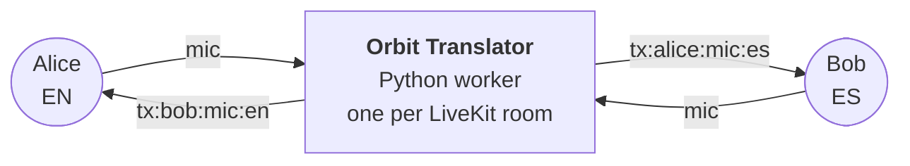
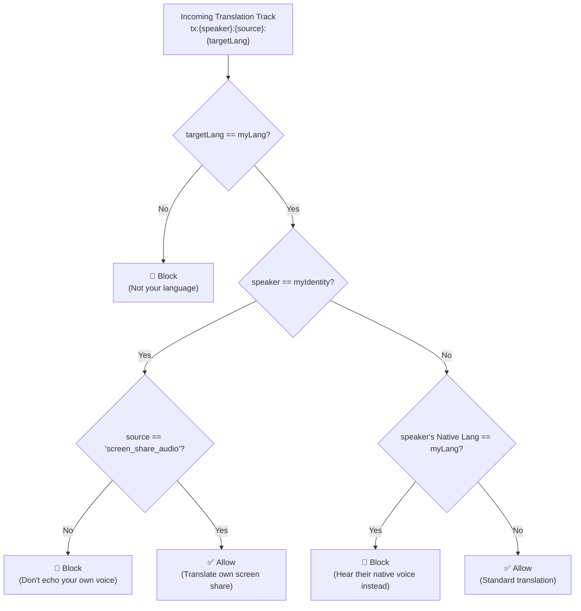

# 🛸 Orbit Meeting — by Eburon AI

**Real-time AI voice translation for video meetings.**  
Speak your language. Hear theirs. Translation spins up on demand — same-language pairs cost nothing.

Proudly built by [Eburon AI](https://eburon.ai) — founded by Joe Lernout.

🌐 **Live at [orbit.eburon.ai](https://orbit.eburon.ai/)**

    

---

## What it does

Anyone with the link joins as a peer. Each participant picks one language — that's what they speak **and** what they want to hear everyone else in. When someone speaks, a Gemini Live session translates their audio into every other distinct language present in the room, on demand.

- **Up to 40 participants** per room (configurable)
- **240+ languages** — pick yours from the world's most comprehensive language list
- **Mic + camera** default off; toggle when you're ready
- **Captions sidebar** with auto-scroll transcripts in each listener's language
- **Screen share with audio translation** — shared content is always translated regardless of the sharer's declared language
- **Start/stop translation** — toggle per meeting from the sidebar
- **Mute original audio** — hear only the translation when you want
- **Gallery View** — responsive grid layout, full-screen when alone, clean tiles as participants join
- **Host moderation** — mute, request camera, remove participants, manage breakout rooms
- **Breakout rooms** — real isolated LiveKit rooms with host assignment and one-click return
- **Local recording** — capture meeting audio/video to your device (File System Access API + download fallback)
- **Supabase auth** — email sign-up/login, password reset, anonymous fallback
- **Zoom-style Settings** — camera preview, virtual backgrounds, recording preferences persisted via Supabase
- **Electron desktop app** — native macOS/Windows/Linux with Ollama auto-install on first launch
- **PWA** — installable on mobile and desktop browsers with offline fallback
- **Android APK** — hybrid Capacitor app loading the production web app

## How it works



Each participant's chosen language lives in their LiveKit `attributes.lang`. The agent watches `participantAttributesChanged` and reconciles a map of `(speaker, track_sid, target_lang)` sessions — one Gemini Live session per unique pair, **skipping pairs where source == target** (same-language pairs hear each other natively, zero Gemini cost).

**Screen share audio** is treated differently: since the shared content (e.g. a video in a browser tab) may be in any language regardless of the sharer's declared `lang`, the agent always translates it and the frontend always ducks the original.

For each active pair the agent publishes into the room:

- an audio track named **`tx:<speaker>:<track_source>:<target_lang>`** carrying the translated speech (`track_source` is `"mic"` or `"screen_share_audio"`)
- an **`lk.translation`** text-stream carrying the matching captions, tagged with `target_lang`

The frontend subscribes to either the native mic or the matching `tx:*` track for each peer, based on `(listener_lang, speaker_lang)` and the track source.

### Translation Routing Logic

The frontend dynamically filters which translation tracks it subscribes to based on the following logic matrix (implemented in `useTranslationRouting.ts`):



### End-to-End Translation Workflow

Here is the exact pipeline from when a participant speaks to when other participants hear the translation:

#### Phase 1 — Room Setup

1. A participant creates or joins a LiveKit room. The frontend calls `GET /api/token?room=...&identity=...&lang=...` which mints a LiveKit JWT that includes a `RoomAgentDispatch` targeting `"gemini-translator"`. This tells LiveKit Cloud to spin up one Python agent worker per room.
2. The agent's entrypoint (`translator/src/agent.py`) registers an `@server.rtc_session(agent_name="gemini-translator")` handler. When dispatched, it connects to the room with `AutoSubscribe.AUDIO_ONLY`, sets its agent state to `"listening"`, and starts a `TranslationRouter` instance.

#### Phase 2 — Demand Reconciliation

1. The `TranslationRouter` (`translator/src/router.py`) wires into LiveKit room events: `participant_connected`, `participant_disconnected`, `participant_attributes_changed`, `track_subscribed`, `track_unsubscribed`, `track_muted`, `track_unmuted`. Any of these schedules a debounced reconcile (250 ms debounce via `RECONCILE_DEBOUNCE_SEC`).
2. On reconcile, `_compute_desired_sessions()` computes the set of `(speaker_identity, track_sid, target_lang)` tuples needed:
   - Collects target languages from all participants' `lang` attribute (excludes the `NATIVE_LANG` sentinel `"none"`).
   - Identifies active speakers with unmuted audio tracks (including screen share audio, which is always eligible regardless of the sharer's declared language).
   - For each `(speaker, track, source_lang)` × target_lang pair, creates a session unless:
     - The speaker's source language matches the target language (same-language pair hears each other natively — zero Gemini cost), **except** in single-user mode (one remote participant) where translation runs unconditionally.
     - For screen share audio: only translates if at least one listener has `orbit_translate_screenshare` != `"false"` (defaults to `true`).

#### Phase 3 — Session Lifecycle

1. For each newly desired `(speaker, track_sid, target_lang)`, the router calls `GeminiSession.start()` in `translator/src/session.py`. This:
   - Publishes a `LocalAudioTrack` into the LiveKit room named `tx:{speaker_identity}:{track_source}:{target_lang}`.
   - Creates an `AudioSource` (24 kHz mono) to receive Gemini's translated audio.
   - Spawns a pump loop task (`_run()`) that opens a raw WebSocket to Gemini.
2. The WebSocket connects to:

   ```text
   wss://generativelanguage.googleapis.com/ws/\
   google.ai.generativelanguage.v1beta.GenerativeService.BidiGenerateContent\
   ?key={GEMINI_API_KEY}
   ```

   The first message is a setup payload (camelCase, exact v1beta schema):

   ```json
   {
     "setup": {
       "model": "models/gemini-3.5-live-translate-preview",
       "outputAudioTranscription": {},
       "inputAudioTranscription": {},
       "generationConfig": {
         "responseModalities": ["AUDIO"],
         "translationConfig": {
           "targetLanguageCode": "es",
           "echoTargetLanguage": true
         }
       },
       "realtimeInputConfig": {
         "automaticActivityDetection": { "disabled": false }
       }
     }
   }
   ```

   The instruction prompt tells Gemini to perform a "faithful vocal mimic" — preserving the source speaker's speed, rhythm, pitch contour, volume, intonation, and emotional delivery exactly in the translated output.
3. Gemini sends a `setupComplete` acknowledgment. Only then does the input pump begin streaming audio.

#### Phase 4 — Audio Capture & Streaming

1. The input pump (`_pump_input`) reads PCM audio from the speaker's RemoteAudioTrack via `rtc.AudioStream` at 16 kHz mono (Gemini's expected input rate). Each chunk is base64-encoded and sent as:

   ```json
   {
     "realtimeInput": {
       "audio": {
         "mimeType": "audio/pcm;rate=16000",
         "data": "<base64 PCM bytes>"
       }
     }
   }
   ```

2. The output pump (`_pump_output`) reads JSON frames from the WebSocket and handles three types of data:
   - **Translated audio**: `serverContent.modelTurn.parts[].inlineData.data` → base64-decode → wrap in `rtc.AudioFrame` (24 kHz mono) → push to the `AudioSource` via `capture_frame()`. LiveKit distributes this to all room participants.
   - **Translated transcription**: `serverContent.outputTranscription.text` (or `serverContent.modelTurn.outputTranscription.text` for some API versions) → publish as an `lk.translation` text-stream with attributes `{ target_lang, source_identity }`.
   - **Source transcription**: `serverContent.inputTranscription.text` → publish as an `lk.translation` text-stream with `{ target_lang, source_identity, kind: "source" }`.
   - On `serverContent.turnComplete`, a final empty transcript is published to flush the captions buffer.

#### Phase 5 — Frontend Routing

1. The frontend's `useTranslationRouting.ts` hook listens for room events (participant/track changes) and for each agent-published track:
   - Parses the track name `tx:{sourceIdentity}:{trackSource}:{targetLang}`.
   - Blocks subscription if track target_lang != my language, or if `translationEnabled` is `false`.
   - Blocks subscription if the track is our own voice echo (unless it's `screen_share_audio` — you need to hear your own shared video translation).
   - Blocks subscription if the speaker already speaks my language natively (hear them directly instead).
   - Applies `setVolume()` based on mute preferences:
     - **Mute original ON**: human mic tracks ducked to 15% volume (faintly audible behind translation).
     - **Mute original OFF**: human mic tracks at 100% alongside translation.
     - **Translator mute ON**: agent translation tracks set to 0 volume.
     - **Speaker mute ON**: all `<audio>` elements in the DOM muted.

#### Phase 6 — Teardown

1. When demand for a session disappears (speaker mutes mic, last listener for a target language leaves, or participant disconnects), the router starts a **10-second grace timer** (`SESSION_GRACE_SEC`). If demand returns before the timer expires — e.g. the speaker unmutes within 10 seconds — the timer is cancelled and the session stays warm. This prevents thrashing Gemini connections on brief coughs or mic toggles.
2. If the timer expires and demand is still absent, the session is torn down: `aclose()` cancels the pump tasks, unpublishes the translation track, and closes the WebSocket.
3. On explicit participant disconnect, sessions for that speaker are torn down **immediately** (no grace window). The backfill on agent startup populates any pre-existing tracks so late joiners see translation immediately.

#### Phase 7 — Recovery

1. On Gemini WebSocket errors, the session retries with exponential backoff: `[0.5, 1, 2, 4, 8, 16, 30]` seconds with 20% jitter. After 5 consecutive failures, it logs at ERROR level and keeps retrying indefinitely with the longest backoff. If the speaker's track ends (they leave), the pump loop exits cleanly and does not reconnect — the router's reconciliation handles cleanup.

---

## Installation and Setup

### Prerequisites

- Node.js 20+, [pnpm](https://pnpm.io/)
- Python 3.10+, [uv](https://docs.astral.sh/uv/)
- A [LiveKit Cloud](https://cloud.livekit.io) project (free tier works)
- A [Gemini API key](https://aistudio.google.com/apikey)

### Run locally

```bash
# 1. Install deps and seed env files
pnpm run setup

# 2. Fill credentials in .env.local and translator/.env.local
#    LIVEKIT_URL, LIVEKIT_API_KEY, LIVEKIT_API_SECRET (both files)
#    GEMINI_API_KEY (translator/.env.local only)

# 3. Run frontend + agent worker together
pnpm run dev
```

Open <http://localhost:3000>, click **Create session**, share the URL with another browser, pick different languages, unmute.

---

## Downloads & Distribution

| Platform      | Format                  | Build command               |
|---------------|-------------------------|-----------------------------|
| **Web** (PWA) | Installable via browser | Auto-deployed to Vercel     |
| **macOS**     | `.dmg` / `.zip`         | `pnpm electron:build:mac`   |
| **Windows**   | `.exe` (NSIS) / portable| `pnpm electron:build:win`   |
| **Linux**     | `.AppImage` / `.deb`    | `pnpm electron:build:linux` |
| **Android**   | `.apk` (debug)          | `pnpm mobile:build`         |
| **Android**   | `.apk` / `.aab` (release)| `pnpm mobile:build:release` |

### Build the Android APK

Requires Android SDK. On any machine with it installed:

```bash
pnpm mobile:sync     # Sync web assets
cd android && ./gradlew assembleDebug
# APK → android/app/build/outputs/apk/debug/app-debug.apk
```

---

## Repo layout

```text
root (pnpm, Next.js 16)
├── src/                              # Next.js 16 (Turbopack, React 19)
│   ├── app/
│   │   ├── page.tsx                  # Landing — create/join/schedule
│   │   ├── globals.css               # All styles (CSS custom properties theming)
│   │   ├── layout.tsx                # Root layout with AuthProvider + UserProvider
│   │   ├── ServiceWorkerRegister.tsx # PWA service worker registration
│   │   ├── api/
│   │   │   ├── token/route.ts        # Mints LiveKit token + dispatches translator agent
│   │   │   ├── translate-voice/      # One-shot Gemini voice translation
│   │   │   ├── translate-text/       # One-shot Gemini text translation
│   │   │   ├── breakout/             # Breakout room management
│   │   │   ├── moderate/             # Moderation actions
│   │   │   └── record/               # Recording control
│   │   ├── session/[id]/
│   │   │   ├── page.tsx              # Pre-flight: name + language picker
│   │   │   └── room/                 # In-call UI (all meeting components)
│   │   ├── auth/                     # Supabase email auth pages
│   │   │   ├── login/                # Sign in form
│   │   │   ├── signup/               # Sign up form
│   │   │   ├── callback/             # Auth code exchange + recovery redirect
│   │   │   ├── reset-password/       # Forgot password
│   │   │   └── update-password/      # Set new password
│   │   └── settings/                 # Zoom-style settings page
│   ├── lib/
│   │   ├── config.ts                # Frontend caps (MAX_PARTICIPANTS, etc.)
│   │   ├── languages.ts             # 240+ languages
│   │   ├── supabase.ts              # Client-side Supabase client
│   │   └── supabase-server.ts       # Server-side Supabase client (cookies)
│   └── context/
│       ├── AuthContext.tsx           # Supabase auth wrapper
│       └── UserContext.tsx           # Supabase-backed user profile
├── translator/                       # Python LiveKit Agents worker (uv)
│   ├── src/
│   │   ├── agent.py                 # @server.rtc_session("gemini-translator")
│   │   ├── router.py                # TranslationRouter: reconcile loop
│   │   ├── session.py               # GeminiSession: raw WebSocket → Live API
│   │   ├── audio.py                 # PCM frame plumbing
│   │   └── config.py                # Agent caps (mirror src/lib/config.ts)
│   ├── tests/
│   │   └── test_router.py           # 14 pure demand-computation tests
│   ├── Dockerfile                   # For LiveKit Cloud Agents deploy
│   └── .github/workflows/ci.yml     # Agent CI (pytest + ruff)
├── electron/                         # Electron desktop wrapper
│   ├── main.js                      # Next.js server lifecycle + BrowserWindow
│   └── preload.js                   # Context bridge for native dialogs
├── android/                          # Capacitor Android project
│   ├── app/                         # Android app with WebView
│   └── gradle/                      # Gradle wrapper
├── public/
│   ├── manifest.json                # PWA manifest
│   ├── sw.js                        # Service worker (network-first with cache fallback)
│   ├── icon.svg                     # Source icon (Orbit globe + speech bubbles)
│   └── icons/                       # Generated PNG icons (192px, 512px, etc.)
├── .github/workflows/
│   └── deploy.yml                   # Vercel auto-deploy on push to main
├── capacitor.config.ts              # Capacitor config (loads from production URL)
└── out/                             # Capacitor web fallback directory
```

## Commands

```bash
pnpm run setup              # Idempotent — seeds .env + installs both halves
pnpm run dev                # Frontend + agent concurrently
pnpm run dev:web            # Frontend only (next dev on :3000)
pnpm run dev:agent          # Agent only (uv run python src/agent.py dev)
pnpm run dev:electron       # Frontend + Electron desktop app
pnpm build                  # Production build (output: standalone)
pnpm start                  # Next.js production server
pnpm lint                   # ESLint

# Desktop (Electron)
pnpm electron:build:mac     # Build macOS .dmg
pnpm electron:build:win     # Build Windows .exe
pnpm electron:build:linux   # Build Linux .AppImage + .deb

# Mobile (Android APK via Capacitor)
pnpm mobile:sync            # Sync web assets to Android
pnpm mobile:build           # Build debug APK
pnpm mobile:build:release   # Build release APK/AAB
pnpm mobile:open            # Open Android project in Android Studio

# PWA
pnpm pwa:icons              # Regenerate PWA icons from SVG

# Deploy
pnpm deploy:vercel          # Manual Vercel deploy

# Agent (from translator/)
uv run pytest               # 14 router unit tests
uv run ruff check           # Lint
uv run ruff format          # Format
```

## Deploy

### Web app

Push to `main` → GitHub Actions builds and deploys to **Vercel** automatically.  
Requires these secrets on the GitHub repo:

| Secret                         | Source                                                         |
|--------------------------------|----------------------------------------------------------------|
| `VERCEL_TOKEN`                 | [vercel.com/account/tokens](https://vercel.com/account/tokens) |
| `VERCEL_ORG_ID`                | Vercel project settings                                        |
| `VERCEL_PROJECT_ID`            | Vercel project settings                                        |
| `LIVEKIT_URL`                  | LiveKit Cloud dashboard                                        |
| `LIVEKIT_API_KEY`              | LiveKit Cloud dashboard                                        |
| `LIVEKIT_API_SECRET`            | LiveKit Cloud dashboard                                        |
| `NEXT_PUBLIC_SUPABASE_URL`      | Supabase project settings                                      |
| `NEXT_PUBLIC_SUPABASE_ANON_KEY` | Supabase project settings                                      |

### Agent — to LiveKit Cloud Agents

```bash
cd translator
lk agent create --secrets-file .env.local .   # First time
lk agent deploy                                 # Subsequent deploys
```

## Configuration

Caps in `src/lib/config.ts` and `translator/src/config.py` — adjust together:

| Setting                   | Default                             | Where                                |
|---------------------------|-------------------------------------|--------------------------------------|
| Max participants per room | 40                                  | token route `MAX_PARTICIPANTS`       |
| Session TTL               | 4h                                  | token route `ttl`                    |
| Empty-room timeout        | 60s                                 | token route                          |
| Departure timeout         | 30s                                 | token route                          |
| Session grace on mute     | 10s                                 | `SESSION_GRACE_SEC` (agent)          |
| Reconcile debounce        | 250ms                               | `RECONCILE_DEBOUNCE_SEC` (agent)     |
| Gemini model              | `gemini-3.5-live-translate-preview` | `GEMINI_MODEL` (agent)               |

### Critical naming (must keep in sync)

The agent dispatch name `"gemini-translator"` is hardcoded in **two places** — change both if renamed:

| File                         | Location                                              |
|------------------------------|-------------------------------------------------------|
| `translator/src/agent.py`    | `@server.rtc_session(agent_name="gemini-translator")` |
| `src/app/api/token/route.ts` | `const TRANSLATOR_AGENT_NAME = "gemini-translator"`   |

### Env files

| File                    | Variables                                                                | Used by              |
|-------------------------|--------------------------------------------------------------------------|----------------------|
| `.env.local`            | `LIVEKIT_URL`, `LIVEKIT_API_KEY`, `LIVEKIT_API_SECRET`                   | Frontend token route |
| `translator/.env.local` | `LIVEKIT_URL`, `LIVEKIT_API_KEY`, `LIVEKIT_API_SECRET`, `GEMINI_API_KEY` | Python agent         |
| `.env` (not committed)  | `NEXT_PUBLIC_SUPABASE_URL`, `NEXT_PUBLIC_SUPABASE_ANON_KEY`              | Settings persistence |

## Tech stack

- **Frontend** — Next.js 16 (Turbopack), React 19, `@livekit/components-react`, `livekit-client`
- **Token mint** — `livekit-server-sdk` (`RoomAgentDispatch` + `RoomConfiguration`)
- **Agent runtime** — `livekit-agents` 1.5 with `AgentServer.rtc_session()`
- **Translation** — Gemini Live API (raw v1beta `BidiGenerateContent` WebSocket with `translationConfig`)
- **Audio I/O** — `livekit.rtc.AudioStream` (16 kHz mono in) + `AudioSource` (24 kHz mono out)
- **Auth** — Supabase email auth with `@supabase/ssr` cookie sessions
- **Desktop** — Electron 35 with `electron-builder` 26 (macOS/Windows/Linux)
- **Mobile** — Capacitor 8 (Android APK, iOS possible)
- **PWA** — Service worker (network-first) + manifest.json with 240+ language support
- **CI/CD** — GitHub Actions → Vercel (production on push, preview on PR)
- **Settings persistence** — Supabase (anon key, falls back silently if no `profiles` table)
- **Typography** — Instrument Serif (display), DM Sans (body), DM Mono (status)
- **Package management** — `pnpm` + `uv`
- **Testing** — `pytest` / `ruff` (Python), ESLint / TypeScript (frontend)

## Key gotchas

- **Session creation**: `sessionStorage` stores name + lang before navigating to `/room`. Hydration reads from `useEffect`, not `useState` initializer (prevents SSR mismatch).
- **Settings persistence**: Supabase upsert falls back silently if `profiles` table doesn't exist. User identity is a random UUID in `localStorage("orbitUserId")`.
- **TrackSource enum naming**: LiveKit protobuf uses `SOURCE_SCREENSHARE_AUDIO` (no underscore between SCREEN and SHARE). The spelling `SOURCE_SCREEN_SHARE_AUDIO` raises `AttributeError` — both occurrences in `router.py` must match.
- **Translator uses raw WebSockets** (not `@google/genai` SDK) to control the exact JSON shape sent to Gemini v1beta. See `session.py` docstring.
- **showSaveFilePicker()** requires a secure context (HTTPS or localhost) — on HTTP deploys falls back to `<a>` download.
- **Agent dependency pin**: `yarl<1.24` in `pyproject.toml` (cp310-only wheel issue).

---

## License

MIT — © 2026 [Eburon AI](https://eburon.ai)
