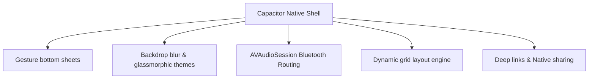

# Upgrade Proposals: Robust Translation & Native Mobile UI

This proposal outlines **10 concrete architectural upgrades** for **Orbit Meeting** to establish a robust, enterprise-grade translation pipeline and deliver a premium, native-feeling mobile/tablet application.

---

## Part 1: Robust & Scalable Translation

These 5 proposals focus on enhancing translation accuracy, reliability, and low-latency failover.

### 1. Dynamic Dialect & Glossary Steering (Gemini Configuration injection)

* **The Idea**: Inject user-defined dictionaries and glossary items dynamically into the Gemini Live WebSocket connection payload.
* **Why it matters**: In specialized meetings (e.g., medical, developer, legal), standard translation models struggle with jargon, acronyms, or brand names.
* **Implementation**: Add a "Glossary" tab in settings. Before connecting to the Gemini Live WebSocket, fetch the session glossary and inject it as part of the `systemInstruction` or within the `generationConfig` translation context, forcing the model to respect custom translations.

### 2. Context-Aware Translation Memory

* **The Idea**: Keep a short-term, rolling vector store or memory cache of the meeting's transcripts in Supabase or local memory.
* **Why it matters**: Translation quality drops when the model lacks context of what was said 2 minutes ago.
* **Implementation**: As utterances complete, feed the transcription history back into the session memory. When Gemini translates the next sentence, provide a highly compressed summarization of the meeting's immediate context so it understands pronouns and subject references.

### 3. Multi-Model Failover & Hybrid Local/Cloud Translation Pipeline

* **The Idea**: Establish a hybrid translation router that automatically degrades gracefully when cloud services or API keys hit limits.
* **Why it matters**: Real-time voice calls cannot tolerate a translation model going offline.
* **Implementation**:
  * **Primary**: Gemini Live Bidirectional WebSocket.
  * **Secondary Cloud Fallback**: Standard Gemini 1.5 Flash REST API (text-to-text) combined with Web Speech Synthesis.
  * **Tertiary Local Fallback**: Run a compact, ONNX-runtime translation model (like MarianMT or a pruned Llama model) locally inside the Electron wrapper or Capacitor app for offline/emergency translation.

### 4. Interactive Real-time Translation Adjustments

* **The Idea**: Allow users to click/tap any translation line in the split sidebar to request a "re-translation" or change of tone (e.g., "Translate to Dutch (formal)").
* **Why it matters**: Automated translations sometimes lack the appropriate tone or level of politeness depending on the meeting's context.
* **Implementation**: Double-clicking a caption sends a message via the LiveKit data channel to prompt standard Gemini on the server side to re-translate that specific phrase with the adjusted tone/dialect parameters, replacing it in the caption UI.

### 5. WebAssembly Noise-Filtering & Acoustic Pre-Processor

* **The Idea**: Integrate client-side WebAssembly noise cancellation (like `RNNoise`) before feeding mic streams to the Python translator agent.
* **Why it matters**: Background noise, echo, and quiet environments lead to severe transcription errors, which compound into bad translations.
* **Implementation**: Pass the browser's microphone stream through an offline audio worklet running RNNoise (WASM) to isolate clean human speech before it ever leaves the client.

---

## Part 2: Native Mobile & Tablet UI/UX

These 5 proposals focus on making the web app feel like a premium, native iOS/Android application on phones and tablets.

### 6. Native bottom sheets & gesture navigation (Capacitor)

* **The Idea**: Replace standard desktop sidebars on mobile screens with native-style swipeable Bottom Sheets.
* **Why it matters**: Sidebars designed for desktop screens feel cramped and unnatural on mobile phones.
* **Implementation**: Use a touch gesture library (like `@ionic/core` or custom touch event handlers) to create slide-up bottom sheets for Chat, Translation, and Participants. Support elastic drag-down-to-dismiss, velocity tracking, and iOS-like haptic feedback when sheets snap into place.

### 7. Adaptive Glassmorphism & System Theme Integration

* **The Idea**: Implement a responsive design system utilizing CSS backdrop filters that match the host OS styling (vibrant dark/light themes).
* **Why it matters**: Web apps often look static; native apps use rich transparency and blur effects to feel alive.
* **Implementation**:
  * Use `backdrop-filter: blur(20px) saturate(190%)` on overlays.
  * Connect to the Capacitor Device and App plugins to dynamically read the system theme (matching iOS dark/light mode dynamically) and set status bar background colors natively to prevent ugly white status bars.

### 8. Native Audio Routing & Hardware Integration

* **The Idea**: Hook into native hardware audio controllers to handle Bluetooth headsets, wired headphones, and speaker routing.
* **Why it matters**: Web browsers on mobile have limited control over audio output routes, causing meetings to play from the earpiece instead of the main speaker or Bluetooth headphones.
* **Implementation**: Use Capacitor plugins (like native Cordova audio routing bridges) to configure iOS `AVAudioSession` and Android `AudioManager` so that the user can switch audio paths (e.g., Speaker, Bluetooth, Earpiece) directly from the meeting room control bar.

### 9. Native Deep-Linking & Universal Links

* **The Idea**: Support clicking meeting links on WhatsApp or calendar entries to open the native app directly instead of the browser.
* **Why it matters**: Copying and pasting room URLs is a tedious friction point for mobile users.
* **Implementation**: Configure universal links (`https://orbit.eburon.ai/session/*`) and custom schema links (`orbit://session/*`) in the iOS `Entitlements` and Android `AndroidManifest.xml` files. When clicked, Capacitor handles the route and launches the call immediately.

### 10. Hardware-Accelerated Responsive Gallery Grid

* **The Idea**: Build a custom CSS grid engine designed to adapt flawlessly to different device orientations on mobile and tablets.
* **Why it matters**: Video grids often lag or crop faces awkwardly when mobile users rotate their device.
* **Implementation**: Use CSS Grid combined with JS layout managers to detect screen orientation. In portrait mode, display a 2x3 or vertical stack grid; in landscape or tablet mode, adapt to a gallery grid. Use CSS `transform: translate3d()` for animations to offload rendering to the GPU, keeping grid transitions running at a fluid 60fps.
